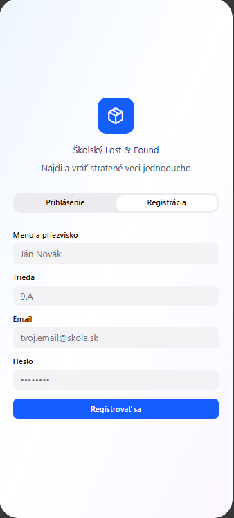
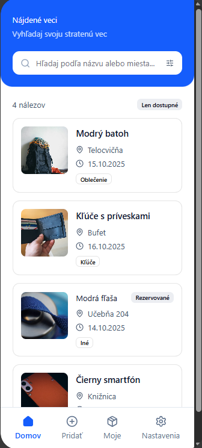
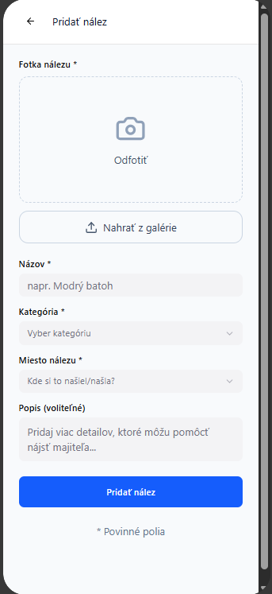
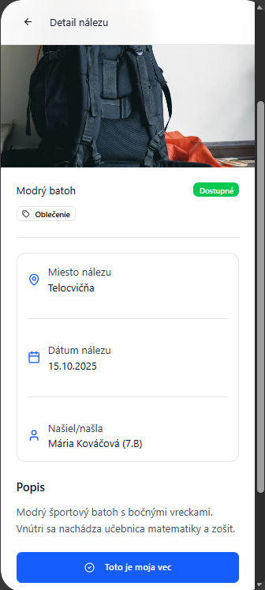
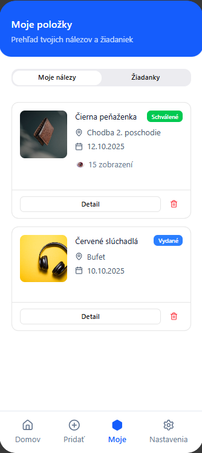

---
# 📱 Školský Lost&Found
## 🧭 Obsah
- [1. Spustenie projektu](#1-spustenie-projektu)
- [Opis mobilnej aplikácie](#opis-mobilnej-aplikácie)
  - [Názov](#názov)
  - [Členovia tímu](#členovia-tímu)
  - [Účel](#účel)
  - [Užívateľské roly](#užívateľské-roly)
  - [Hlavné funkcie](#hlavné-funkcie)
  - [Obrazovky (návrh)](#obrazovky-návrh)
  - [Odkazy na návrhy/UI](#odkazy-na-návrhyui)
- [Technický prehľad](#technický-prehľad)
- [📸 Ukážky obrazoviek](#-ukážky-obrazoviek)

---

## 1. Spustenie projektu

**Inštalácia závislostí**
```bash
npm install
```

**Spustenie vývojového servera**
```bash
npm run start
```

---

## Opis mobilnej aplikácie

### Názov

**Školský Lost&Found**

### Členovia tímu
- Hybel Gregor – III.SA, 1. skupina  
- Adam Jakub – III.SA, 1. skupina

### Účel
Aplikácia rieši problém stratených a nájdených vecí v škole. Umožní žiakom jednoducho pridať nález s fotkou, majiteľovi rýchlo dohľadať položku podľa kategórie/miesta a učiteľovi/správcovi potvrdiť vydanie.

**Cieľová skupina:** žiaci a učitelia školy  
**Hodnota:** rýchlejšie navrátenie vecí, menej chaosu, transparentný prehľad nálezov a notifikácie pri zhode

### Užívateľské roly
| Rola | Možnosti |
|---|---|
| **Neregistrovaný návštevník** | prehliadanie zoznamu nálezov, vyhľadávanie a filtre |
| **Žiak (registrovaný)** | pridať nález (fotoaparát + popis), „to je moja vec“, správa vlastných nálezov/žiadaniek, notifikácie |
| **Učiteľ / Správca** | schvaľovať/skrývať príspevky, označiť položku ako vydanú, správa kategórií a lokalít, štatistiky |

### Hlavné funkcie
1. Registrácia/Prihlásenie (email/heslo alebo školský kód)  
2. Profil používateľa (meno, trieda; editácia)  
3. **Pridať nález:** fotka z kamery/galérie, názov, popis, kategória (oblečenie, technika, kľúče…), miesto nálezu, dátum  
4. Zoznam a detail položky (fotka, informácie, história)  
5. Vyhľadávanie a filtre (kategória, dátum, miesto, len dostupné)  
6. **„Je moja vec“** – žiadanka majiteľa + správa pre správcu  
7. Moderovanie (schváliť/skryť, zlúčiť duplicitné, označiť ako vydané)  
8. Notifikácie (schválenie, zhoda podľa kľúčových slov/filtra, pripomienka po 14 dňoch)  
9. História a stav (čaká na vyzdvihnutie / vydané / expirované)  
10. Odhlásenie

> ℹ️ *Report nevhodného obsahu je zatiaľ mimo zadania (možno doplníme neskôr).*

### Obrazovky (návrh)
- **Prihlásenie / Registrácia:** email + heslo (alebo školský kód), „Pokračovať“  
- **Domov / Zoznam nálezov:** karty s fotkou, názvom, miestom a dátumom; vyhľadávanie a filtre hore  
- **Pridať nález (kamera):** náhľad → odfotiť → formulár (názov, popis, kategória, miesto) → uložiť  
- **Detail položky:** veľká fotka, popis, miesto, stav; tlačidlo „Je moja“ (odoslať žiadanku)  
- **Moje položky:** moje nálezy a moje žiadanky  
- **Nastavenia:** notifikácie (zap./vyp., kľúčové slová), profil, odhlásenie

### Odkazy na návrhy/UI
- **Figma:** _vložiť odkaz na projekt_  
- **Screeny:** ukladaj do `docs/screens/` a referencuj nižšie

---

## Technický prehľad
**Nefunkčné požiadavky:**  
jednoduchosť, responzívnosť, stabilita, notifikácie po súhlase, moderný dizajn, jednoduchá údržba.

---

## 📸 Ukážky obrazoviek

> Ulož obrázky do `asset/screens/` a použi relatívne cesty. Nižšie sú dve pohodlné možnosti.

**Markdown varianta**
```md








`

